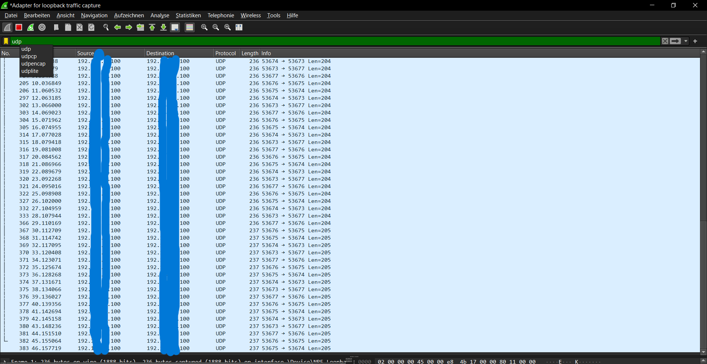

## Bericht Helene Christ

### Aufgabe 2
Nach mehrfachen Versuchen hat es nicht funktioniet einen Ring mit einem Programm außerhalb meines eigenen Computers aufzubauen. 
Wir hatten es versucht mit auschalten der Firewall, geschaut ob der Router irgendwelche Einstellungen hatte die das Aufbauen des Ringes verhindern könnte, was keine Resultate lieferte. Auch der Ping Befehl in der bash hatte keine Chance den anderen Rechner zu erreichen.
Mit Tests im Programm konnten wir zumindest ausschließen, dass weder die IP Adresse falsch war noch der Port, da keine IOExeption geschmissen wurde. 

### Aufgabe 3

